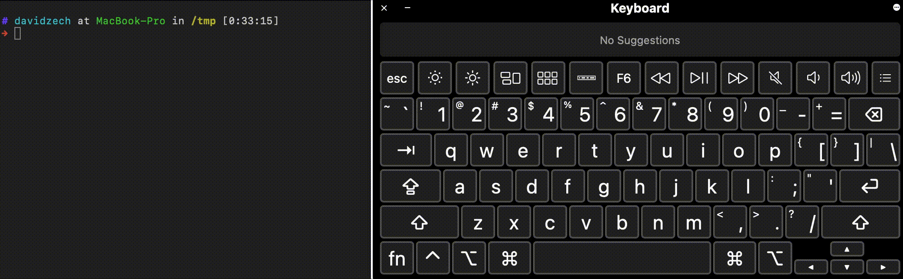

# Autopilot

Fearlessly present your command line demos with precision. Inspired by [Hackertyper](http://hackertyper.com)



## Usage

```console
→ autopilot.sh --help
A tool that automatically types your script into a new instance of your shell via PTY. 
                        When you press a key, the next character of your script is entered into the PTY. Newlines are only consumed when you press [enter].

Usage:
  autopilot [flags] script

Flags:
  -h, --help           help for autopilot
  -s, --shell string   Shell to use for execution (default "/bin/zsh")
```

## Hashbang

Autopilot is invokable via hashbang

```sh
#!autopilot --shell=/bin/sh

echo hello world
```
